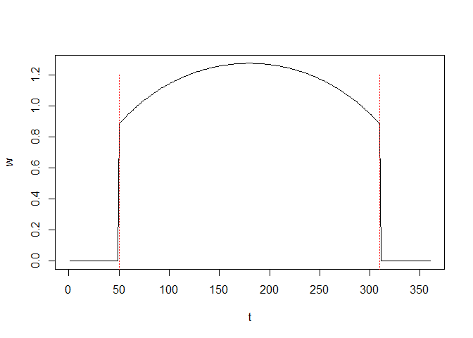

Analysis of skyline data

### Installation
The package can be installed directly from a bundled .tar.gz file or directly from GitHub, using `install_github` from remotes.


```r
# If not already installed:
# install.packages(c("remotes"))
library(remotes)  # for install_github

# install skyline from github
install_github("NERC-CEH/skyline")
```

And if it installs successfully:


```r
library(skyline)
# Check version installed
packageVersion("skyline")

# check the help:
?skyline
# currently the only properly documented function:
?read_cs_data
```

The code uses the workflow management package [targets](https://books.ropensci.org/targets/) 
to ensure reproducibility, and some understanding of that helps, but is not essential .
To run it for an experiment, you need to configure the settings in the 
`_targets.R` file and run the code in `run.R`.  This  looks like:


```r
here::i_am("./run.R")
library(targets)
tar_outdated()
system.time(tar_make())
```

### Deadband identification algorithm

The sensor measuring the chamber position provides an output voltage which records which location is being measured along the transect. However, this does not record the exact start and end times of chamber closure, and the enclosure period needs to be distinguished from the "deadbands" before and after in order to calculate the flux correctly.
The function `remove_deadband` contains two methods to do this.
 The simplest approach is to estimate the deadbands as fixed intervals at the start and end of the period delineated by the
chamber position sensor, and this can be chosen using the `method = "specified deadband only"` argument to the `remove_deadband` function.
More sophisticated is the `"time fit"` method; the idea of this is to identify points at the start and end which show a different pattern to those in the central portion of the data.
We do not want to base this on the pattern in a single gas, but use the joint signal from all measured gases.
The algorithm involves a number of steps.
Firstly, we calculate a vector of weights which give most weight to the central portion of the data, declining towards the start and finish, and potentially zero in some pre-defined minimal deadband intervals. We use a beta distribution to do this, as illustrated below.

<!-- -->

This vector of weights is then used in a weighted linear regression, predicting time $t$ from the measured gas concentrations $\chi$ as well as the chamber position signal $V_{chpos}$ (which tends to be constant when the chamber is static, but varies in-between).

$$t_{pred} = \beta_{0} + \beta_{1} \chi_{CO_2} 
                + \beta_{2} \chi_{H_2O}
                + \beta_{3} \chi_{CH_4}
                + \beta_{4} \chi_{N_2O}
                + \beta_{5} V_{chpos}$$

In the central portion of the data, which the fit is weighted towards, and is expected to approximate linear change in a normal flux measurement, this equation should provide close predictions i.e. small residuals $t^{\prime} = t - t_{pred}$. In the deadbands, the equation should provide poor predictions because the concentrations are changing because of processes other than diffusion from the surface (e.g. time lags in the measurement system, readjustment between ambient and chamber concentrations, and leakage into or from a partially open chamber).
We can therefore use large residuals $t^{\prime}$ as indicators of deadbands, and exclude values which exceed some threshold value.
We standardise these residuals by their standard deviation $\sigma_{t^{\prime}}$, and by default exclude values greater than 1 (i.e. $> \sigma_{t^{\prime}}$).
However, we do not want to simply impose an assumption of linearity on the data, so we only exclude values on this basis in the first and last quarters. All data in the central half (i.e. second and third quarters) are retained.
The beta distribution also gives the flexibility for an asymmetric distribution, to give higher weight to the earlier phase which should be closer to the assumption of linearity, if deemed appropriate.

The `remove_deadband` function returns a subset of the original data table, with the records identified as deadband removed. If the `dryrun` argument is set to `TRUE`, the same calculations are performed, but no data are removed.

### References
Some background on the uncertainty propagation is in here:

Levy, P.E., Gray, A., Leeson, S.R., Gaiawyn, J., Kelly, M.P.C., Cooper, M.D.A., Dinsmore, K.J., Jones, S.K., Sheppard, L.J., 2011. Quantification of uncertainty in trace gas fluxes measured by the static chamber method. European Journal of Soil Science 62, 811–821. https://doi.org/10.1111/j.1365-2389.2011.01403.x

